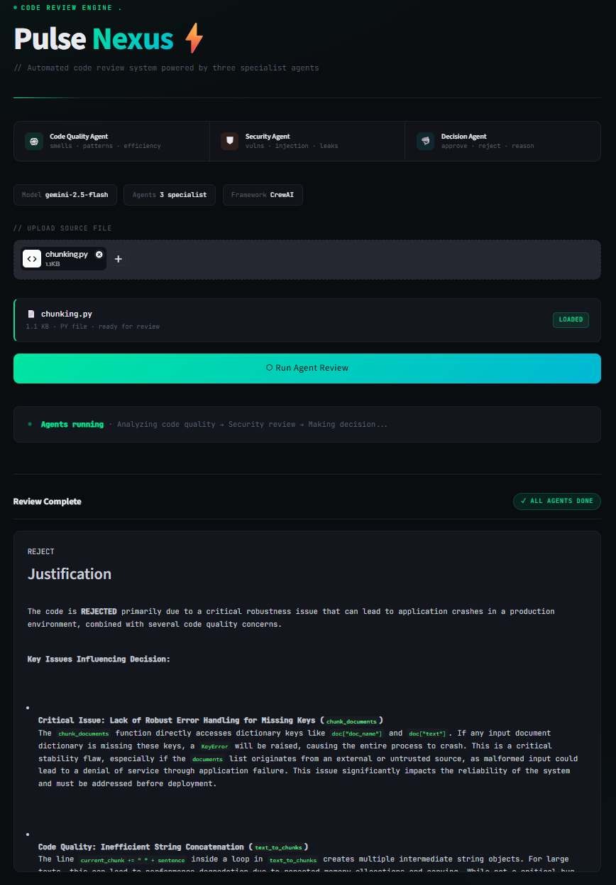

# 🔰 Nexus — Multi-Agent Code Review System

## 🎯 Overview

Nexus is a production-grade automated code review system powered by three specialist AI agents working in a sequential pipeline.

The system analyzes any uploaded source file through three independent stages — code quality analysis, security vulnerability detection, and a final approval decision — each handled by a dedicated agent with its own role, goal, and guardrail logic.

Rather than running a single monolithic LLM call, Pulse Nexus distributes the review responsibility across specialized agents, producing structured, reliable, and explainable outputs for each stage.

---

## 📸 Preview

<p align="center">
  
</p>

> Upload any code file → Three agents run sequentially → Final APPROVE / REJECT decision with full reasoning

---

## 🔭 Vision

Nexus is designed as a demonstration of how multi-agent orchestration can replace manual code review workflows in engineering teams.

> The goal is to show that complex review logic — which normally requires senior engineers — can be broken into specialized, auditable agent tasks that produce consistent, structured output at scale.

Future iterations aim to support:

- Real-time GitHub PR integration
- Agent-level confidence scoring
- Multi-language deep analysis
- Team-level review dashboards

---

## 💰 Real-World Impact

Manual code review is:
- Slow
- Expensive
- Dependent on senior engineers

Pulse Nexus reduces:
- Review time from hours → seconds
- Human dependency in early-stage review
- Security risks in production pipelines

Potential use cases:
- **CI/CD pipelines** — auto-block unsafe code before it reaches production
- **Startup teams** — get senior-level review without dedicated reviewers
- **Large-scale auditing** — scan entire codebases consistently and fast

---

## 🧩 Core Concepts

### 🤖 Agent Pipeline (CrewAI)

- **Code Quality Agent** → Detects code smells, bad practices, inefficiencies, and readability issues
- **Security Agent** → Identifies vulnerabilities, injection risks, hardcoded secrets, and unsafe patterns
- **Decision Agent** → Synthesizes both analyses and issues a final APPROVE or REJECT verdict
- **Sequential Execution** → Each agent's output feeds into the next agent's context
- **LLM Factory** → Provider-agnostic LLM abstraction using CrewAI's LLM wrapper

### 🛡 Guardrails

- **Security Guardrail** → Validates risk levels, ensures `highest_risk` matches actual vulnerabilities, blocks malformed outputs
- **Decision Guardrail** → Enforces that the final output explicitly contains APPROVE or REJECT

### 🔗 Execution Layer

- **File Hook** → Reads uploaded source file from disk and injects content into agent inputs
- **Streamlit UI** → Single-page interface for file upload, pipeline execution, and result rendering
- **Structured JSON Output** → Code quality and security agents return validated Pydantic models

---

## 🏛️ Architecture Flow

```
User Input (UI)
    ↓
read_file_hook → reads file content from temp path
    ↓
crew.kickoff(inputs={file_path, file_content})
    ↓
    ├── Agent 1: Code Quality Analyst
    │       ↓
    │   Analyzes: (smells · bad practices · inefficiencies)
    │       ↓
    │   Output: { issues: [...], suggestions: [...] }  ← Pydantic validated
    │
    ├── Agent 2: Cybersecurity Expert
    │       ↓
    │   Analyzes: (vulns · injection · secrets · API misuse)
    │       ↓
    │   Output: { vulnerabilities, blocking, highest_risk, recommendations }
    │       ↓
    │   Security Guardrail → validates risk levels and consistency
    │
    └── Agent 3: Technical Lead Reviewer
            ↓
        Synthesizes both analyses
            ↓
        Output: APPROVE or REJECT + full reasoning  ← markdown
            ↓
        Decision Guardrail → enforces approve/reject presence
    ↓
Final Output
```

---

## ✅ How To Run

**1. Clone the repository**

```bash
git clone https://github.com/Aravind73205/nexus
cd pulse-nexus
```

**2. Create virtual environment**

```bash
python -m venv .venv

# Windows
.venv\Scripts\activate

# Mac/Linux
source .venv/bin/activate
```

**3. Install dependencies**

```bash
pip install -r requirements.txt
```

**4. Set up environment variables**

- Create a `.env` file in the root directory:

```
GEMINI_API_KEY=your_gemini_api_key_here
```

**5. Run the application**

```bash
streamlit run app.py
```

---

## 📂 Project Structure

```
nexus/
│
├── agents/                          # Specialist AI Agents
│   ├── code_quality_agent.py        
│   ├── security_agent.py            
│   └── decision_agent.py            
│
├── tasks/                           # Agent Task Definitions
│   ├── analyze_code.py              
│   ├── review_security.py           
│   └── make_decision.py             
│
├── guardrails/                      # Output Validation Layer
│   ├── security_guardrail.py        
│   └── decision_guardrail.py        
│
├── hooks/                           
│   └── read_file.py                 
│
├── llms/                            
│   └── factory.py                   
│
├── app.py                           
├── crew.py                          # Crew assembly and kickoff logic
├── requirements.txt                 
├── .env                             
└── .gitignore
```

---

## ⚙️ Key Technical Decisions

- **CrewAI Sequential Pipeline** — agents run in strict order; each agent's output is available as context to the next
- **Pydantic Output Validation** — code quality and security tasks use `output_json` with Pydantic models to enforce structured output
- **Guardrail Layer** — each task with structured output has a guardrail that validates logic consistency, not just schema
- **Provider-agnostic LLM Factory** — `factory.py` uses `crewai.LLM` so the underlying model can be swapped without touching agent code
- **File Hook Pattern** — file reading is separated from crew logic, keeping `crew.py` clean and the hook independently testable
- **Built-in Retry** — CrewAI handles LLM call retries natively; no custom retry logic needed

---

## 🛡 Guardrails System

Guardrails validate agent outputs before they are accepted by the pipeline.

#### 1) Security Guardrail (`security_guardrail.py`)

- Validates that `highest_risk` is one of `low`, `medium`, `high`
- Validates that every individual vulnerability has a valid risk level
- Checks that `highest_risk` actually appears in the vulnerability list
- Checks that `highest_risk` matches the maximum risk level found — prevents agents from under-reporting severity

#### 2) Decision Guardrail (`decision_guardrail.py`)

- Checks that the final decision output explicitly contains `APPROVE` or `REJECT`
- Rejects vague or ambiguous outputs that don't commit to a decision

Guardrails are pluggable — they are passed directly into the task definition and run automatically after each agent execution.

---

## 🔮 Upcoming Enhancements

1. GitHub PR Integration — trigger review pipeline directly from pull requests
2. Streaming Output — progressive rendering as each agent completes
3. Per-Agent Confidence Score — quantify how certain each agent is about its findings
4. Multi-language Support — extend beyond Python to JS, Go, Java
5. Review History Dashboard — persist and compare reviews across sessions
6. Async Parallel Execution — run quality and security agents simultaneously

---

## ⚡ Summary

Nexus demonstrates how complex, multi-stage review logic can be distributed across specialized agents with strict output contracts, validation guardrails, and a clean separation between execution and presentation layers.

Built as a working prototype, it shows that production-grade AI systems don't require monolithic LLM calls — they benefit from the same modular design principles that make good software engineering.
